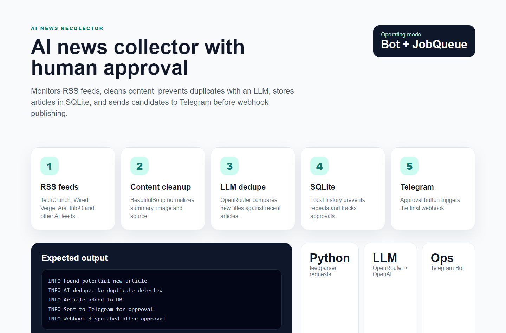

# AI News Recolector

AI News Recolector is a Python bot that monitors AI news RSS feeds, cleans article metadata, checks for duplicates with an LLM, stores candidates locally and sends them to Telegram for human approval before webhook publishing.


Portfolio cover generated for presentation. Runtime screenshot:



## What it demonstrates

- RSS ingestion from multiple AI and technology sources.
- Article cleaning and metadata extraction with BeautifulSoup.
- SQLite storage for deduplication and auditability.
- LLM-assisted duplicate detection through OpenRouter-compatible chat completions.
- Telegram bot workflow with approval buttons.
- Optional image generation/upload step after approval.
- Webhook dispatch only after a human approves the item.

## Stack

- Python
- feedparser
- BeautifulSoup
- SQLite
- OpenRouter/OpenAI-compatible APIs
- python-telegram-bot
- requests

## Run locally

```bash
pip install -r requirements.txt
python main.py
```

Required environment variables:

```text
WEBHOOK_URL
TELEGRAM_BOT_TOKEN
TELEGRAM_CHAT_ID
OPENROUTER_API_KEY
```

Optional image-generation settings can be configured with the variables already referenced in `main.py`.

## Core flow

1. Scheduled job reads RSS feeds.
2. New articles are cleaned and normalized.
3. Recent titles are checked to avoid duplicates.
4. Candidate articles are saved to SQLite.
5. Telegram receives an approval message.
6. Approved articles are sent to the configured webhook.
